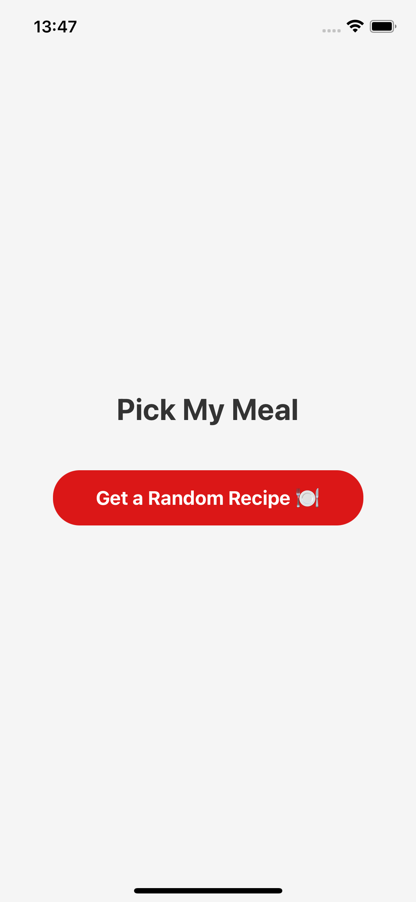
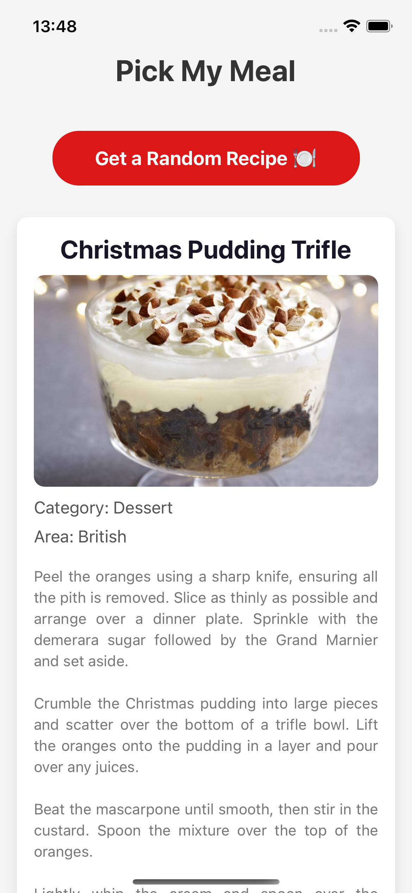

# Pick My Meal

**Pick My Meal** is a mobile application that helps users decide what to eat by providing random recipes. Using the **TheMealDB API**, the app fetches a random recipe, including details such as the meal name, category, area, instructions, and an image.

---

## **Features**
- Fetch a random meal recipe with one tap.
- Displays:
  - Meal Name
  - Category
  - Area (Cuisine Type)
  - Recipe Instructions
  - Meal Image
- Simple and user-friendly interface.

---

## **Screenshots**
### 1. Random Recipe Button Screen


### 2. Meal Recipe Screen


---

## **Installation**
Follow these steps to run the app locally:

### Prerequisites
- Node.js installed on your machine.
- `npm` or `yarn` installed.
- Expo CLI installed globally:
  ```bash
  npm install -g expo-cli
